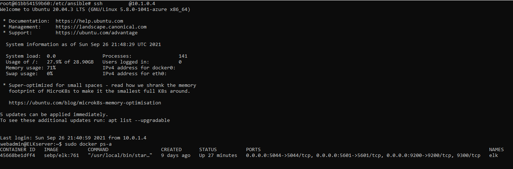

## Automated ELK Stack Deployment

The files in this repository were used to configure the network depicted below.

These files have been tested and used to generate a live ELK deployment on Azure. They can be used to either recreate the entire deployment pictured above. Alternatively, select portions of the playbook file may be used to install only certain pieces of it, such as Filebeat.

This document contains the following details:
- Description of the Topologu
- Access Policies
- ELK Configuration
  - Beats in Use
  - Machines Being Monitored
- How to Use the Ansible Build

### Description of the Topology

The main purpose of this network is to expose a load-balanced and monitored instance of DVWA, the D*mn Vulnerable Web Application.

Load balancing ensures that the application will be highly available, in addition to restricting ACCESS to the network.

Integrating an ELK server allows users to easily monitor the vulnerable VMs for changes to the logs and system metrics.

The configuration details of each machine may be found below.

| Name      	| Function  	| IP Address 	| Operating System  	|
|-----------	|-----------	|------------	|-------------------	|
| Jump Host 	| Gateway   	| 10.0.1.4   	| Linux             	|
| Web 1     	| Webserver 	| 10.0.0.5   	| Linux             	|
| Web 2     	| Webserver 	| 10.0.0.7   	| Linux             	|
| ELK-VM     	| ELKserver 	| 10.1.0.4   	| Linux             	|

### Access Policies

The machines on the internal network are not exposed to the public Internet. 

Only the Jump Host machine can accept connections from the Internet. Access to this machine is only allowed from the following IP addresses:
- (Local Machine IP)

Machines within the network can only be accessed by Jump Host.
- The Ansible container contained the ELK Machine. The IP Address is 10.1.0.4.

A summary of the access policies in place can be found in the table below.

| Name      	| Publicly Accessible 	| Allowed IP Address 	|
|-----------	|---------------------	|--------------------	|
| Jump Host 	| Yes                 	| 10.0.1.4           	|
| Web 1     	| No                  	| 10.0.0.5           	|
| Web 2     	| No                  	| 10.0.0.7           	|
| ELKserver    	| No                  	| 10.1.0.4           	|

### Elk Configuration

Ansible was used to automate configuration of the ELK machine. No configuration was performed manually, which is advantageous because...
- Using ansible to automate configurations is advantageous because it allows us to configure multiple machines with just running a single command to install the playbook. It also allows us to have the right files and tools to be installed without missing anything.

The playbook implements the following tasks:
- Install docker.io
- Install python3-pip
- Install Docker Module
- Download and Launch and ELK container
- Increases Virtual Memory

The following screenshot displays the result of running `docker ps` after successfully configuring the ELK instance.

### Target Machines & Beats
This ELK server is configured to monitor the following machines:
- 10.0.0.5
- 10.0.0.7

We have installed the following Beats on these machines:
- Filebeat
- Metricbeat

These Beats allow us to collect the following information from each machine:
- Filebeat - allows us to monitor log files and forwards and centralizes log data for specific locations and forwards them to elasticsearch or logstash for indexing.  
- Metricbeat - collects metrics and statistics from the OS and services running on the server and forwards them to elasticsearch or logstash.

### Using the Playbook
In order to use the playbook, you will need to have an Ansible control node already configured. Assuming you have such a control node provisioned: 

SSH into the control node and follow the steps below:
- Copy the filebeat-playbook.yml and metricbeat-playbook.yml file to /etc/ansible/roles.
- Update the /etc/ansible/roles file to include the IP address of the Webservers and ELKservers.
- Run the playbook, and navigate to https://(ELKserver-Public-IP):5601 to check that the installation worked as expected.

_As a **Bonus**, provide the specific commands the user will need to run to download the playbook, update the files, etc._

